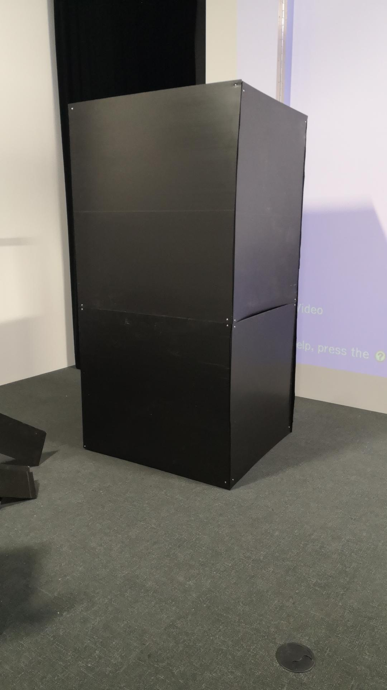
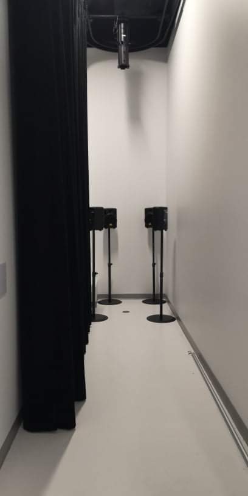

# Titre
3 minutes
# Les créateurs et créatrices
*Naoufal Bensaiad
*Jérémie Lévesque
*Samuel Poulin
# La façon dont le thème du temps  est exploité dans la création
Sensibilisée a l'intimidation et démontrer que le temps n'est pas le même selon la situation vécu.
source:https://tim-montmorency.com/2022/projets/3-minutes/docs/web/preproduction.html
# L'ambiance
Lors de la partie vr de ce jeu projet,la personne ressent du plaisir à passer un bon moment en s'amusant à jouer au ballon chasseur en touchant le plus d'adversaire possible.Puis tout d'un coup, après 3 minutes tout s'arrête.Ensuite,cette même personne, est dirigée vers un casier dont elle doit se mettre à l'intérieur.Puis, après un certains temps, qui est bien évidemment moins que 3 minutes,une atmosphère d'angoisse s'installe du fait que les lumières si trouvant à l'intérieur s'éteignirent et une trame sonore remplie d'insulte embarque dans le but de pouvoir simuler une intimidation.
# L'installation en cours dans les studios (photos à l'appui)
Comme vous pouvez le voir ici,c'est l'installation des 8 hauts-parleurs et test de son Branchement des deux lumières.

Source:https://tim-montmorency.com/2022/projets/3-minutes/docs/web/index.html

Ici,c'est l'installation du casier ainsi que des panneaux de coroplast dans le coulir.

Source:https://tim-montmorency.com/2022/projets/3-minutes/docs/web/index.html

Là,c'est le branchement et tests sonores des gros speakers.

Source:https://tim-montmorency.com/2022/projets/3-minutes/docs/web/index.html

Maintenant,c'est le placement du détecteur de mouvement.

Source:https://tim-montmorency.com/2022/projets/3-minutes/docs/web/index.html

