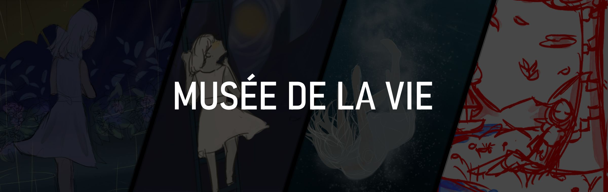
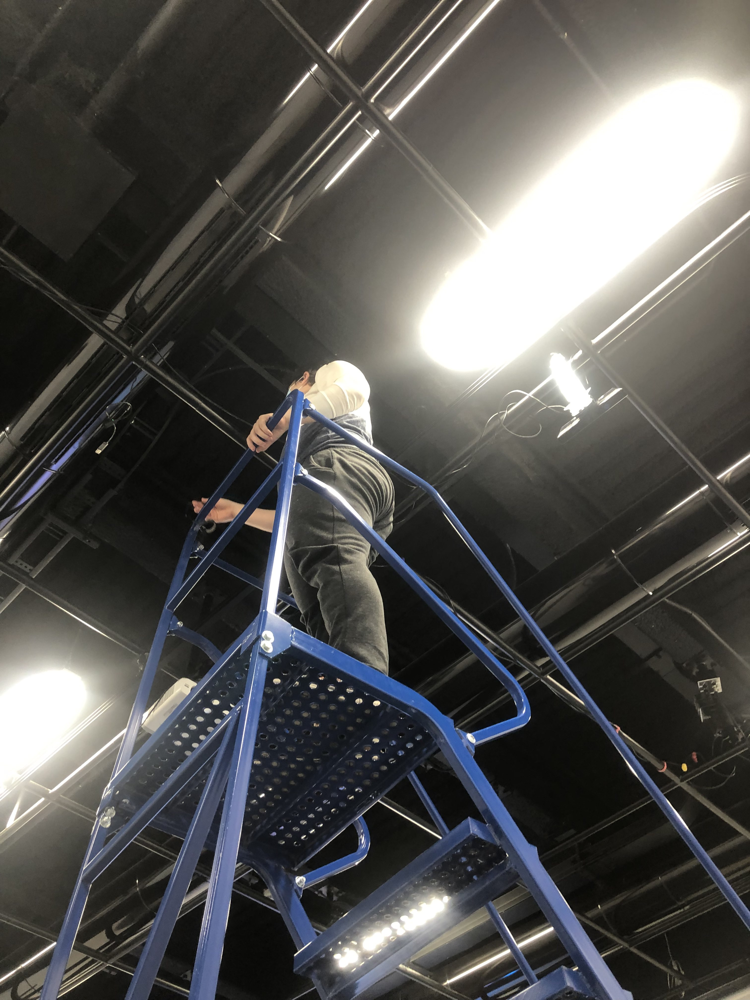
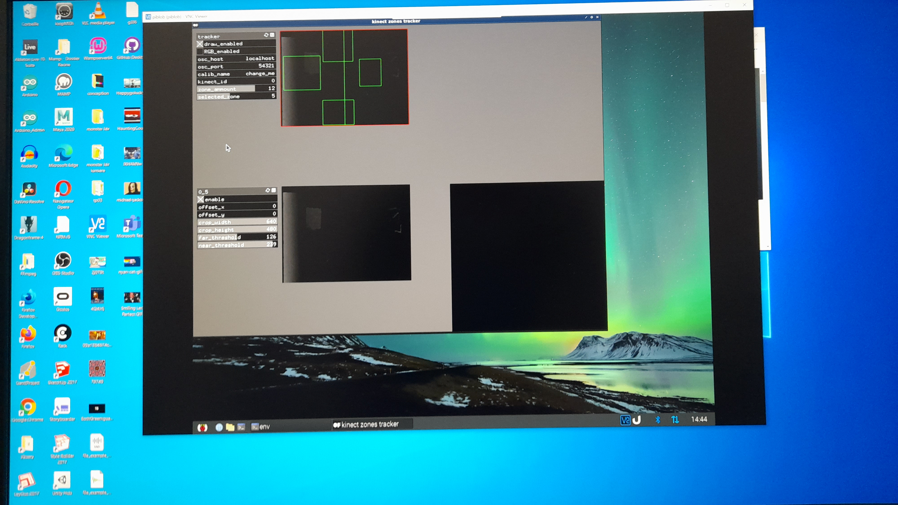

# Titre
Chronaufrage
# Les créateur et créatrices
- Maloney Khim
- Sounthida Kong
- Olivier Lalonde
- Rebecca Pilotte
- Émilie Fontaine
# La façon dont le thème du temps est exploité dans la création
Par ce projet,nous souhaitons exposer la pression vécue dans notre société de devoir être toujours plus productives afin d'exprimer la nécessité de prendre des pauses ou du temps pour soi.Nous souhaitons ainsi faire valoir l'importance du temps ¨mort¨ et ¨improductif¨ pour s'accomplir comme humain. On utilisel'eau comme la symbolisation du temps.

Source:https://www.youtube.com/watch?v=SATIxHCn6SI (à 1minute de la vidéo)
# L'ambiance
Sur ce projet-ci,l'ambiance est basé sur l'eau et nos mouvements.Tout au long,nous allons pouvoir entendre un trame sonore de pluie très calme qui fera qu'en sorte que nous ayons un sentiment d'apaisement.En ce qui concerne nos mouvements, auprès de ce projet,c'est qu'au fur et à mesure que la personne bouge et se déplace,celà crée un changement chez le personnage du projet.Au début,le personnage montre un sentiment malheureux et pour finir avec un sentiment de bien être paisible.
# L'installation en cours dans les studios (photos à l'appui)
Par ici,nous avons l'installation de la Kinect ainsi que de la barre horizontale

Source:https://tim-montmorency.com/2022/projets/Chronaufrage/docs/web/index.html

# Le schéma de l'Instation prévue

Source:Github du projet Chère Sasha
## Ce qui sera attendu de nous,en tant qu'interacteur.trice,lorsque vous ferez l'expérience de l'installation
Nous avons juste à écouter la vidéo de sasha puis lui écrire un message de réconfort.
## 3 cours du programme qui vous semblent incontournables pour avoir les compétences pour créer ce projet
- Conception sonore
- Conception vidéo
- Conception de projet multimédia
# Références:https://tim-montmorency.com/2022/projets/Chere-Sasha/docs/web/index.html et https://github.com/task-tim/Chere-Sasha

