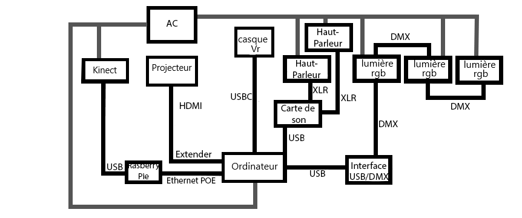

# Distortion Collective

# Titre
Distortion Collective

# Créateurs/Créatrices
- William Dubois
- Ghislain Lacombe

# Façon dont le thème du temps est exploité dans la création
Le projet nous montre, avec le thème du temps, l'évolution de l'angoisse ressentie par un étudiant durant les diférentes phases du confinement.

# Ambiance
Le décor bordélique et mal organisé de chaque pièce de la maison nous représente le chaos mental ressenti par l'élève durant les periodes du confinement. Les premières journées du confinement avec les cours en ligne, il n'y a rien d'anormal qui se passe. Plus que le temps avance, moins que l'élève a de la facilité à comprendre ce que son professeur dit, ceci est l'effet de l'angoisse. 

# Installation en cours dans les studios
L'installation est composée d'un bureau avec une chaise où l'intéracteur s'asseois pour utiliser le casque vr, il y a aussi un spot de lumière par dessus le bureau. Il y a un projecteur qui projette sur un mur ce que l'intéracteur voit dans son casque. Il y a 2 haut-parleurs sur chaque côté du mur pour jouer la tramme sonore avant que l'intétacteur met le casque et après qu'il l'enlève.

# Schéma de l'installation
### Plantation

### Branchement

# Ce qui sera attendu de nous en tant qu'interactrice, lorsque nous ferons l'expérience de l'installation

# 3 cours du programme qui vous semblent incontournables pour avoir les compétences pour créer ce projet

# Références
