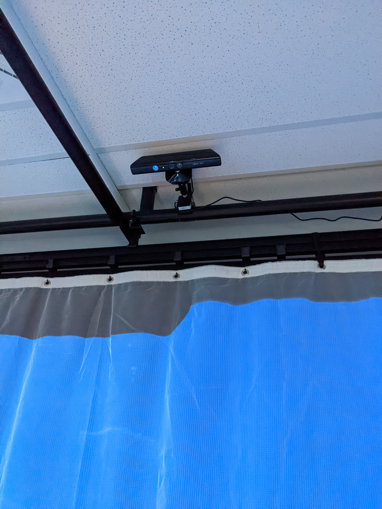
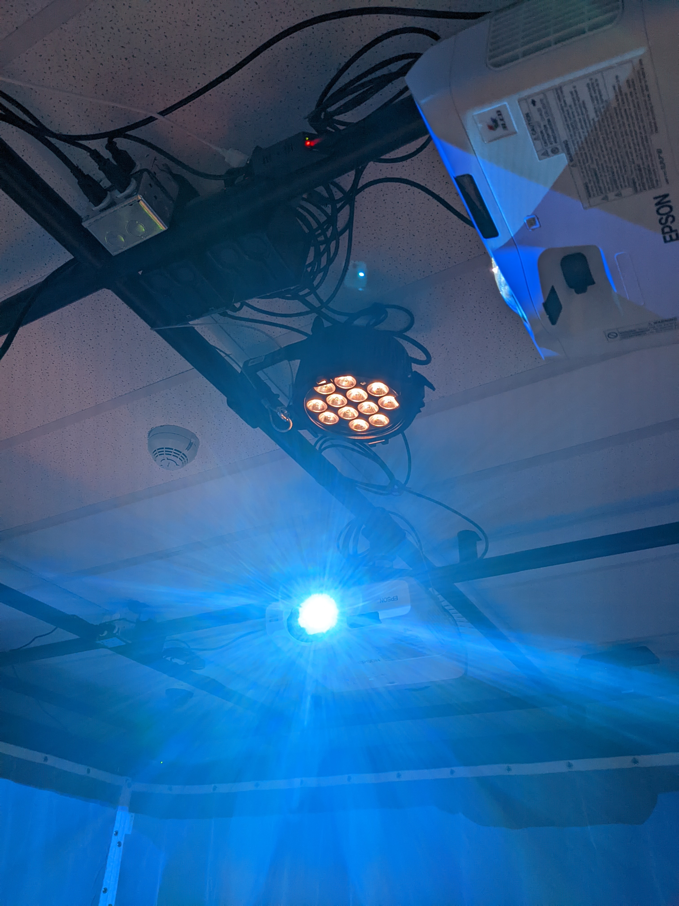

# L'horloge de l'apocalypse

# Titre
L'horloge de l'apocalypse

# Créateurs/Créatrices
- Maxime Sabourin
- Louis-Philippe Gravel
- Alexis Lacasse
- Tristan Girard-Montpetit
- Maxime De Falco

# Façon dont le thème du temps est exploité dans la création
Le projet représente l'impact collectif sur les événements socio-politiques et environnementaux qui se produisent tout au long du temps de l'humanité. Ils abordent ce sujet à travers l'entiereté du concept de l'horloge de l'apocalypse. Ils utilisent une horloge et chaque heure de l'horloge est une certaine periode de temps dans l'histoire de l'humanité. Source: https://tim-montmorency.com/2022/projets/L-horloge-de-l-apocalypse/docs/web/preproduction.html

# Ambiance
L'ambiance du projet est différente à chaque heure. Les premières heures montrent les temps de l'humanité comme la création de la terre et les temps préhistoriques. C'est une ambiance plus heureuse tandis que les dernières heures sont plus sombres et montrent les conséquennces environnementales créées par l'avancement de l'humanité. Ces dernières heures nous montrent l'impact personnel que chaque personne à sur l'environnement.

# Installation en cours dans les studios
L'installations est composée de 3 projecteurs qui couvrent 3 murs de la salle avec les scenes du projet. Il y a une Kinect pour détecter la présence de l'intéracteur. 

Pour l'audio, il y a 4 haut-parleurs dans chaque coin de la salle pour les effets sonores qui ajoutent à l'ambiance du projet. 

Il y aussi un spotlight qui éclaire le pédestal au centre de la piece.

# Schéma de l'installation 
## Plantation

